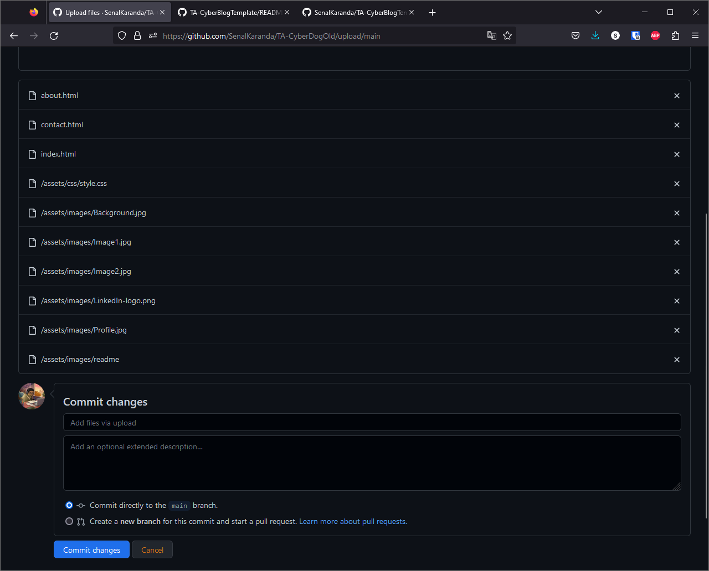
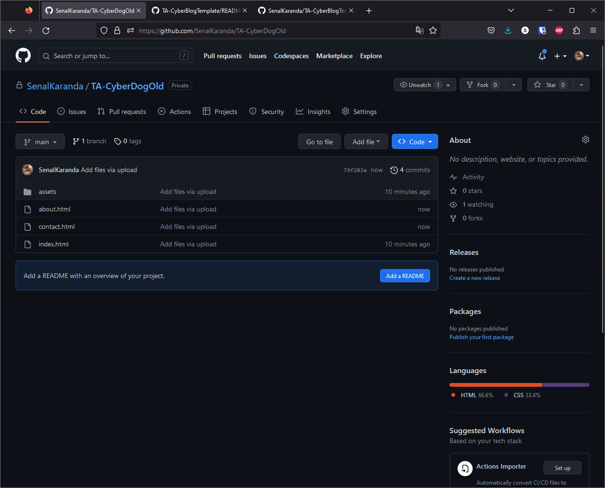

# A Template for My Students

## Step 1:
### Download this repository


## Step 2:
### Open the downloaded zip file and press ```Extract All```
#### Keep the file explorer that pops up open


## Step 3:
### Navigate to your blog's repository page, and enter the ```assets``` folder
### Delete your ```assets``` folder


## Step 4:
### Navigate to your blog's repository page again, and press ```Upload Files```
#### MAKE SURE YOU'RE IN THE ROOT OF THE REPO BEFORE PRESSING UPLOAD


## Step 5:
### In your file explorer, navigate to the ```src```


## Step 6:
### Add the files to your GitHub repo and press ```Commit changes```
#### This folder is located within your extacted folder from earlier



## Step 7:
### You're done! Cloudflare should notice the changes and automatically update your blog.


